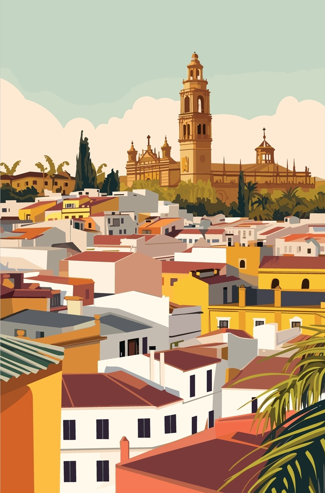

  

# LangDev 2024 - Travel information

[Home](../README.md)

## Seville

Seville is a monumental city located at the South of Spain. Its well-known as the America's Gate during the XVI century as all the commerce between America and Spain was centralized in the city.

Don't forget to reserve some time to visit the city and get lost on its ancient streets.

## How to arrive to Seville?

### By Plane

`SVQ` [Seville Airport](https://www.aena.es/en/sevilla.html)

Flights from/to Europe destinations from carriers:

- Air France
- Austrian Airlines
- BA Euroflyer
- EasyJet
- Edelweis
- Iberia
- Lufthansa
- RyanAir
- Scandinavian Airlines
- TAP
- Transavia
- Vueling
- Wizz

### By High-Speed Train

AVE Train (2 hours 45 min)
from Madrid, Atocha Station ([map](https://maps.app.goo.gl/Z7tHz8C4ttNfLjSX9))
to Seville, Santa Justa Station ([map](https://maps.app.goo.gl/XU5PFWRDgj6ALpBE9)).

[Trainline.com](https://www.thetrainline.com/en/stations/seville)

## Where to stay

The city is plenty of accommodations ranging all kind of prices from hotels to house rentals.

- [Booking](https://www.booking.com/)
- [airbnb](https://www.airbnb.es/)
- [Last Minute](https://lastminute.com/)
- [Trivago](https://www.trivago.es/en-US/)

## Tourism and landmarks to visit

- [Plaza de España](https://www.andalucia.org/en/sevilla-visitas-plaza-de-espana)
- [Real Alcazar de Sevilla](https://www.realalcazarsevilla.com/)
- [Seville Cathedral & La Giralda](https://catedraldesevilla.com/en/)
- [Seville City Hall](https://visitasevilla.es/en/seville-city-hall/)
- [Archivo General de Indias](https://www.andalucia.org/en/sevilla-cultural-tourism-archivo-general-de-indias)
- [Las Setas de Sevilla](https://www.setasdesevilla.com/en/)
- [Roman city of Itálica](https://www.italicasevilla.org/en/), Santiponce

[More ideas.](https://sevillecityguide.com/attractions-seville.html)

## Wheater

May & October are the ideal months to visit Seville to avoid the extreme heat in summer.

[Temperatures](https://www.accuweather.com/es/es/seville/306733/october-weather/306733) are soft & warm ranging: 17 ºC - 27 ºC.

## Food & drink

Try the [local food](https://devourtours.com/blog/typical-foods-in-seville/?cnt=ES) and get inspired.
