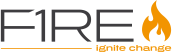
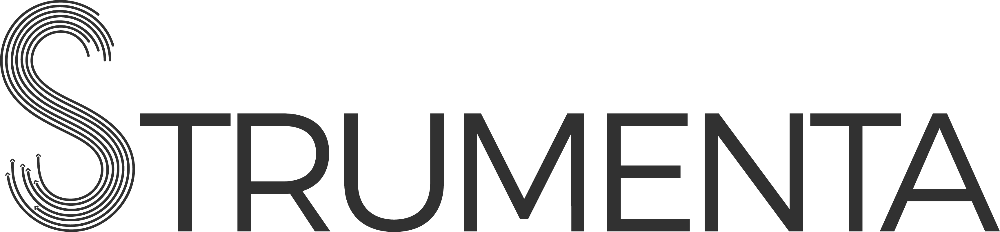

  

    
    

      <nav>
        <a class="ml2 current">Home</a>
        <a href="2024/program" class="ml2">Program</a>
        <a href="2024/speakers" class="ml2">Speakers</a>
        <a href="2024/venue" class="ml2">Venue</a>
        <a class="ml2 btn cta">Get Tickets</a>
      </nav>
    

  

  

    

      <h1 class="mt12 title-xl" >&num;langdev2024</h1>
      
Aerospace Edition

      
LangDev Conference

      
Seville, 17-19 October 2024.

      
Where language engineering enthusiasts from both industry and academia
    come together to discuss the <em>state of the art</em> &amp; <em>state of the practice</em> of language enginering.
      

      

        <a class="btn secondary" href="2024/venue">Plan your travel</a>
        <a class="btn cta ml2" href="">Get Tickets</a>
      

      

    

      
    

  

  

    <h2 class="title-m">Sponsors</h2>
    

     
     
     
   

   <a class="btn tertiary" href="https://metadev.pro/contact/">Become a sponsor &rarr;</a>
  

  

   <h2 class="title-m">Collaborators</h2>
   

   

   <a class="btn tertiary" href="https://metadev.pro/contact/">Collaborate with us &rarr;</a>
  

  <h2>Topics & Goals</h2>

LangDev is celebrated on an yearly basis around Europe. It brings together the community working & researching around Language Engineering, MDE, DSLs with a clear focus on showing progress on the state of the art with working tooling. Talks with running software demonstrations are encouraged over just theoretical papers.

<strong>Model Driven Engineering</strong> is gaining traction as one of the Key competences to be developed to foster progress (as recognized by the European Union in different programs).

  <h2>Special Edition</h2>

  
Seville's edition is putting the emphasis on <strong>Aerospace</strong> sector and <strong>Security</strong>.
  

  
Seville has an enterprise cluster of companies devoted to Aerospace. The organization want to take the opportunity to reunite and promote the interchange between the industry and research to align research & transfer technologies as a meeting point for a unique networking opportunity.
  

On the other hand, <strong>Security</strong> and cybersecurity is a central topic for any digital system. Sophistication of attacks demands better security tools, process and analysis tools. Models. modeling tools & DSLs for security are on the rise.

<h2>Location</h2>

<strong>Escuela Técnica Superior de Ingeniería Informática</strong> 
Universidad de Sevilla 
Avenida Reina Mercedes, s/n. 41012 Seville, Spain 

<a href="https://maps.app.goo.gl/dWGjuFmpbTh4NbFeA">Map</a>

Registration takes place directly on site. Please have your ticket and passport or European identification card at hand.

<h2>Registration</h2>

Tickets will be announced soon. Registration is strictly required. Please use your full name as shown on your passport.
Registration is available until <strong>1st of October, 2024</strong>

<h2> Important Dates</h2>

<ul>
  <li><strong>04.06.2024</strong>: Call for Presentations</li>
  <li><strong>15.07.2024</strong>: Submission Deadline</li>
  <li><strong>15.09.2024</strong>: Acceptance Notification</li>
  <li><strong>01.10.2024</strong>: Registration Deadline</li>
  <li><strong>17.10.2024-19.10.2024</strong>: LangDev’24</li>
</ul>

<h2> Preliminary Schedule</h2>

<table class="schedule">
    <tr class="day">
        <td colspan="3">Thursday, October 17</td>
    </tr>
    <tr>
        <td>8:30</td>
        <td colspan="2">Registration</td>
    </tr>
    <tr>
        <td>9:00</td>
        <td colspan="2">Welcome</td>
    </tr>
    <tr>
        <td>9:30</td>
        <td>
          Slot 1
        </td>
        <td>to be announced</td>
    </tr>
    <tr>
        <td>10:00</td>
        <td>
          Slot 2
        </td>
         <td>to be announced</td>
    </tr>
    <tr class="break">
        <td>10:30</td>
        <td colspan="2">Coffee break</td>
    </tr>
    <tr>
        <td>11:00</td>
        <td>
          Slot 3
        </td>
         <td>to be announced</td>
    </tr>
    <tr>
        <td>11:30</td>
       <td>
          Slot 4
        </td>
         <td>to be announced</td>
    </tr>
    <tr>
        <td>12:00</td>
        <td>
          Slot 5
        </td>
         <td>to be announced</td>
    </tr>
    <tr class="break">
        <td>12:30</td>
        <td colspan="2">Lunch</td>
    </tr>
    <tr>
        <td>14:00</td>
        <td>
          Slot 6
        </td>
        <td>to be announced</td>
    </tr>
    <tr>
        <td>14:30</td>
        <td>
          Slot 7
        </td>
        <td>to be announced</td>
    </tr>
    <tr>
        <td>15:00</td>
        <td>
          Slot 8
        </td>
        <td>to be announced</td>
    </tr>
    <tr class="break">
        <td>15:30</td>
        <td colspan="2">Coffee break</td>
    </tr>
    <tr>
        <td>16:00</td>
        <td>
          Slot 9
        </td>
        <td>to be announced</td>
    </tr>
    <tr>
        <td>16:30</td>
        <td>
          Slot 10
        </td>
        <td>to be announced</td>
    </tr>
    <tr>
        <td>17:00</td>
        <td>
          Slot 11
        </td>
        <td>to be announced</td>
    </tr>
     <tr>
        <td></td>
        <td>
        </td>
        <td></td>
    </tr>
     <tr class="social">
        <td>21:00</td>
        <td colspan="2">
          Gala Dinner
        </td>
    </tr>
</table>

<table class="schedule" >
    <tr class="day">
        <td colspan="3">Friday, October 18</td>
    </tr>
    <tr>
        <td>8:30</td>
        <td colspan="2">Registration</td>
    </tr>
    <tr>
        <td>9:00</td>
       <td>
          Slot 1
        </td>
        <td>to be announced</td>
    </tr>
    <tr>
        <td>9:30</td>
        <td>
          Slot 2
        </td>
        <td>to be announced</td>
    </tr>
    <tr>
        <td>10:00</td>
        <td>
          Slot 3
        </td>
        <td>to be announced</td>
    </tr>
    <tr class="break">
        <td>10:30</td>
        <td colspan="2">Coffee break</td>
    </tr>
    <tr>
        <td>11:00</td>
       <td>
          Slot 4
        </td>
        <td>to be announced</td>
    </tr>
    <tr>
        <td>11:30</td>
        <td>
          Slot 5
        </td>
        <td>to be announced</td>
    </tr>
    <tr>
        <td>12:00</td>
        <td>
          Slot 6
        </td>
        <td>to be announced</td>
    </tr>
    <tr class="break">
        <td>12:30</td>
        <td colspan="2">Lunch</td>
    </tr>
    <tr>
        <td>14:00</td>
        <td>
          Slot 7
        </td>
        <td>to be announced</td>
    </tr>
    <tr>
        <td>14:30</td>
        <td>
          Slot 8
        </td>
        <td>to be announced</td>
    </tr>
    <tr>
        <td>15:00</td>
        <td>
          Slot 9
        </td>
        <td>to be announced</td>
    </tr>
    <tr class="break">
        <td>15:30</td>
        <td colspan="2">Coffee break</td>
    </tr>
    <tr>
        <td>16:00</td>
        <td>
          Slot 10
        </td>
        <td>to be announced</td>
    </tr>
    <tr>
        <td>16:30</td>
        <td>
          Slot 11
        </td>
        <td>to be announced</td>
    </tr>
    <tr>
        <td>17:00</td>
        <td colspan="2">Closing</td>
    </tr>
</table>

<table class="schedule">
    <tr class="day">
        <td colspan="3">Saturday, October 19</td>
    </tr>
    <tr class="social">
        <td>9:00 12:00</td>
        <td>
          Guided City Tour
        </td>
        <td>to be announced</td>
    </tr>
</table>

<h2>Call for Presentation</h2>

  <em>To be open in June, 2024.</em>

We solicit talk proposals concerning the application, development, and innovation of language engineering. Topics of interest include, but are not limited to:

<ul>
  <li>Novel meta languages for language construction and composition</li>
  <li>Holistic approaches to language engineering that cross-cut multiple language aspects (e.g., abstract and concrete syntax, semantics, transformations) and/or integrate with program analysis, validation, testing, or other advanced techniques.</li>
  <li>New language workbenches or novel extensions of existing language workbenches.</li>
  <li>Backend infrastructure of (web-based) language workbenches explaining solutions to collaboration, synchronization, or communication.</li>
  <li>Industrial case studies: experience reports, large-scale evaluations, best practices, and human factors to adoption.</li>
  <li>Low-Code / No-Code approaches using appropriate languages
  <ul>
      <li>Languages for describing and deriving digital twins</li>
      <li>Languages for non-engineering issues, such as science, legal, social, or environmental sustainability issues</li>
      <li>DSLs engineered on the basis of GPLs and GPMLs (general-purpose languages)</li>
    </ul>
  </li>
  <li>LangDev seeks presentations that demonstrate applied aspects of language engineering. Presentations explaining the theory behind language engineering are also welcome, but they need to showcase the practical applicability of the presented approaches. Presentations about preliminary or unfinished work are welcome.</li>
</ul>

We encourage presenters to demonstrate their work with a <strong>demo or live coding</strong> over “just” showing slides. Additionally, we encourage speakers to accompany their presentations with a <strong>reproduction package</strong> that helps the participants to (easily) run the presented tools, experiment with them, or tweak benchmark experiments. This helps to create a lasting contribution.

<h2> Program Committee</h2>

<ul>
  <li>Arjan Oortgiese - <em>Belastingdienst (Dutch Tax Office)</em></li>
  <li>Bernhard Rumpe, <em>Software Engineering - RWTH Aachen</em></li>
  <li>Nico Jansen -  <em>RWTH Aachen</em></li>
  <li>Federico Tomassetti - <em>Strumenta S.R.L.</em></li>
  <li>Tijs van der Storm - <em>Centrum Wiskunde & Informatica</em></li>
  <li>Antonia Reina - <em>University of Seville</em></li>
  <li>Angel J. Varela - <em>University of Seville</em></li>
  <li>Pedro J. Molina - <em>Metadev S.L.</em></li>
</ul>

All proposals will undergo reviewing by the program committee.  

<h2> Organization</h2>

In case you have any further questions, please contact: [langdev2024@metadev.pro](mailto:langdev2024@metadev.pro)

Organizers:

<ul>
  <li>Antonia Reina - <em>University of Seville</em></li>
  <li>Pablo Fernandez - <em>University of Seville</em></li>
  <li>Angel J. Varela - <em>University of Seville</em></li>
  <li>Lucía Enríquez - <em>Metadev S.L.</em></li>
  <li>Nuria Serrano - <em>Metadev S.L.</em></li>
  <li>Pedro J. Molina - <em>Metadev S.L.</em></li>
</ul>

<h2>Previous Editions</h2>

  <ul>
    <li><a href="Langdev2023.html">Utrecth, 2023</a></li>
    <li><a href="Langdev2022.html">Aachen, 2022</a></li>
    <li><a href="langdev2020.html">Mainz, 2020</a></li>
    <li><a href="Langdev2019.html">Amsterdam, 2019</a></li>
    <li><a href="Langdev2018.html">Amsterdam, 2018</a></li>
  </ul>

  

  

  <strong>LangDev'24</strong> is organized by the <a href="https://www.us.es/">University of Seville</a> &amp; <a href="https://metadev.pro/">Metadev</a>.
  

  

    
    
  

