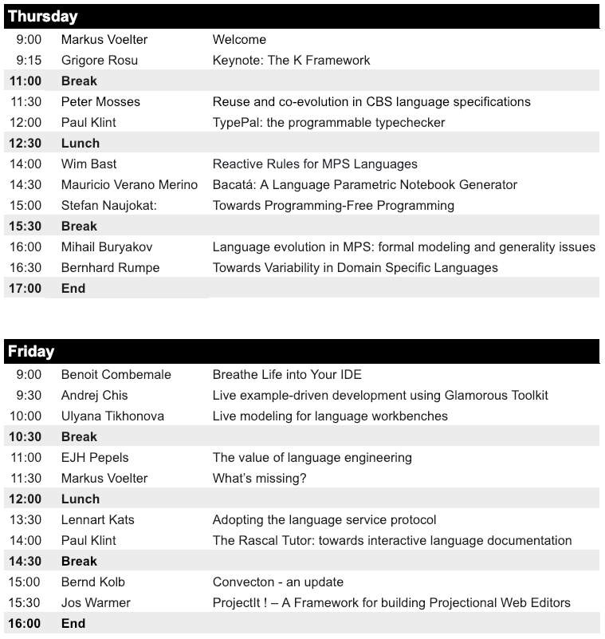

## LangDev Meetup at JGU Mainz 27-28 April 2020

### Location

JGU Mainz Helmholtz-Institut building - Staudingerweg 18 - 55128 Mainz, Germany

Map: https://goo.gl/maps/23t15x1VW1JWb2Sm8

### Registration

Please Register <a href="https://docs.google.com/forms/d/e/1FAIpQLSdDnvQdrL89hFb2VAWJLlV6pUuBmcOc7x3wRaE4rFV9FER2PA/viewform">on this google form</a> <b>by January 31, 2019</b>.

### Schedule

### KEYNOTE: The K Framework

New languages and virtual machines are proposed at an alarming rate, followed by new versions of them every few weeks, together with programs in these languages that are responsible for actions of potentially significant value. Many bugs and exploits, for example in the new cryptocurrency space, are due to flaws or weaknesses of the underlying programming languages or virtual machines.  Formal analysis and verification tools are therefore needed immediately for such languages and virtual machines.  The usual post-mortem approach to formal language semantics and verification, where the language is firstly implemented and used in production for many years before a need for formal semantics and verification tools naturally arises, simply does not work anymore.  We present recent academic and commercial results in developing languages and virtual machines that come directly equipped with formal analysis and verification tools. The main idea is to generate all these automatically, correct-by-construction from a formal specification in the <a href="http://kframework.org">K Framework</a>. We will also give a demo of the K framework by means of a simple language.

Grigore Rosu is a professor in the Department of Computer Science at the University of Illinois at Urbana-Champaign (UIUC), where he leads the Formal Systems Laboratory (FSL), and the president and CEO of Runtime Verification, Inc (RV).  His research interests encompass both theoretical foundations and system development in the areas of formal methods, software engineering and programming languages.  Before joining UIUC in 2002, he was a research scientist at NASA Ames.  He obtained his Ph.D. at the University of California at San Diego in 2000.  He was offered the CAREER award by the NSF, the Dean's award for excellence in research by the College of Engineering at UIUC in 2014, and the outstanding junior award by the Computer Science Department at UIUC in 2005.  He won the ASE IEEE/ACM most influential paper award in 2016 (for an ASE 2001 paper), the Runtime Verification test of time award (for an RV 2001 paper), the ACM SIGSOFT distinguished paper awards at ASE 2008, ASE 2016, and OOPSLA 2016, and the best software science paper award at ETAPS 2002.

### Talks and abstracts

Wim Bast: **Reactive Rules for MPS Languages** 

'Dclare for MPS' is an (opensource) MPS plugin that adds a 'rules' aspect to language definitions. By adding attributes, reactive-rules and structs to language definitions, we effectively support attribute-grammars in MPS. Rules (using base-language) and attributes can be defined on repositories, modules, models, nodes or structs. All rules behave incrementally and immediately. Wim Bast will demonstrate how much fun it is to define transformations and interpreters in MPS now. 

Jos Warmer: **ProjectIt ! – A Framework for building Projectional Web Editors**

ProjectIt is a TypeScript/JavaScript framework to create and implement projectional editors for Domain-Specific Languages (DSLs). ProjectIt is mostly unopinionated with regards to the models that can be projected. Only a small interface to the DSL needs to be provided. The framework provides an internal DSL to specify projections and typical editor behaviour. It's the job of the developer of the projectional editor to map models to that projection DSL.  The framework provides out of the box functionality for: (1) Projections using text, horizontal and vertical grouping, SVG, grids/tables (2) Selections and aliases (3) Navigation in the editor (4) Model element collections including adding and deleting model elements (5) Editing expressions with associativity and precedence rules. The DSL implementor needs to provide callbacks for manipulating the state of the model based on actions defined in the editor. By design, ProjectIt is an editor only. It does not impose any specific way of defining a DSL, neither does it say anything about how and/or where a model is being stored or other typical DSL aspects. Having said this, some optional helper decorators are provided to support quickly defining a metamodel in TypeScript. ProjectIt is an open source project (see http://www.projectit.org) and will be available before LangDev.

Bernd Kolb: **Convecton - an update**

At last year's LangDev we presented the idea of Convecton. A lot has happened since. In this talk we want to provide an update to the community. We will primarily show a few demos of sample applications built with Convecton and how they use the Convecton workbench. We will explain the fundamental architectural building blocks as well as our lessons learned while developing them. As it turns out, building a web based, real-time collaborative, projectional editor supporting multiple notations, backed by a server side persistence, capable of advanced analyses is quite an endeavor. We will wrap up with an outlook of what are the next steps.

m.verano.merino: **Bacatá: A Language Parametric Notebook Generator**

Interactive notebooks enable people to communicate and transfer knowledge in a single rich document. This document is arranged as a collection of cells that allows users to interleave live code, multimedia, computed results, and documentation. Notebooks have become broadly adopted in various domains such as data science, data journalism, programming education, and machine learning. Currently, there are notebook interfaces for various programming languages (e.g., Python, Ruby, Scala, Go, JavaScript, Julia).  DSLs may also benefit from having a notebook interface. However, building a notebook interface for a new language is a cumbersome activity. To speed up the development process of a notebook interface, we present Bacatá. Bacatá is a language parametric notebook generator for domain-specific languages (DSLs) based on the Jupyter platform. One of the main goals of Bacatá is to enable language engineers to reuse existing language components (e.g., parsers, interpreters, type checkers, code generators) as much as possible.  We present the Bacatá architecture and how language engineers can generate notebooks interfaces for DSLs with a minimum effort in the context of the Rascal language workbench.

Stefan Naujokat: **Towards Programming-Free Programming**

Programming language technology has reached a maturity level where *programming-free programming*, which directly enables application experts to express the intentions in an enactable fashion, is within reach. CINCO, our corresponding framework supports: *Domain specificity*: CINCO generates development environments for domain-specific graphical programming languages, which, in our case, typically enhance graphical notations used in the application domain. *Full Generation*: CINCO-generated development environments support full code generation, with the goal to bring the application experts' intention to use in a push button fashion. *Service-orientation*: CINCO's support of service-orientation allows one to easily integrate and use new functionality in terms of service calls, and even to integrate other DSLs in a service-oriented fashion. This allows one to keep the main language simple and to modularily treat tasks that are beyond the application experts' competence. Our experience with CINCO-generated development environments is very promising: We have successfully used them in numerous industrial projects and for teaching, both at the undergraduate and the graduate level. Moreover, even CINCO itself, which can be regarded as a domain-specific environment for generating development environments for domain-specific languages, is conceptually built according to the three features mentioned above, with the consequence that CINCO itself can be successfully used for teaching metamodel-based language design, also both at the undergraduate and the graduate level. CINCO is under development for more than six years and effectively in use for four years. A main problem for acceptance was always the distribution and installation of the Eclipse-based CINCO products. In order to overcome this bottleneck, we are currently developing Pyro, which generates development environments for the Web. This is a major project, as it requires to realize a lot of features for the browser which are taken as granted when using Eclipse. However, as CINCO itself is built along the three principles introduced above (but on the meta level), Pyro allows for taking the same CINCO tool definitions and provides the Web as an alternative target platform; you just hit a different button for generation. At LangDev, we intend to illustrate Pyro's state of the art, and to discuss shortcoming and ideas for improvement.

Paul Klint: **TypePal: the programmable typechecker**

Typecheckers form an essential part of compilers, analysis and transformation tools and IDEs.  Typecheckers have to handle many tangled concerns including scoping, name analysis, overloading, use-def analysis, type correctness and in some cases type inference. Most typecheckers are manually programmed with considerable effort.  With TypePal we try to reduce this effort by providing a programmable framework that mostly automates the above mentioned concerns while preserving flexibility, extensibility and programmability. A TypePal-based typechecker consists of two phases: collecting type constraints during a single traversal of the source program and a subsequent solver phase. I will sketch the architecture of TypePal and how it is integrated in the Rascal language workbench. Sample applications (including a Rascal typechecker) and a short demo conclude this presentation.

Bernhard Rumpe: **Towards Variability in Domain Specific Languages**

We demonstrate an approach to add variability in a systematic way to given domain specific languages. The result is an extended DSL incorporating language mechanisms for featured variability plus a feature based selection tool. 

Benoit Combemale: **Breathe Life into Your IDE**

Live modeling brings facilities to enhance modeling environments with immediate feedback (from changes on the model to the runtime state, and possibly the execution trace), and direct manipulation (from changes on the runtime state to the model). Such facilities are helpful in tuning specific solutions, exploring design spaces, or performing tradeoff analysis. Hence, live modeling have a growing appeal among very different stakeholders, ranging from software and systems engineers, to scientists, decision makers, artists or the general public.  After a brief introduction of several case studies illustrating the different scenarios expected by language users, I explore in this talk live modeling from the point of view of a language engineer. I describe a general approach to bring this new concern in the specification of domain-specific languages. Then I explore the underlying challenges, review the current initiatives, and propose a research roadmap. As take away messages, the audience will learn about live modeling and how to support it in the development of domain-specific languages. A description of the current initiatives, the open challenges and an associated research roadmap is given to help the community in future investigations. 

Andrej Chis: **Live example-driven development using Glamorous Toolkit**

When writing a unit test, we often start by creating and configuring an object capturing a business or a technical aspect, check if certain actions on that object have an expected outcome, and finish by throwing that object away. So after going through all the work to create an interesting object, we just throw it away. That's a waste. We could instead use it to improve our development experience. Examples are somewhat like tests that return objects. This apparent small change can have deep implications on development. First, through examples a developer can switch rapidly from the static code to a live environment and program in the presence of objects. Second, examples can serve as the basis for live documentation. Thus, we can reuse the testing effort to enable better stories about our systems, libraries and DSLs. This session will be a hands-on experience of developing driven by examples using the Glamorous Toolkit IDE (http://gtoolkit.org). 

Ulyana Tikhonova: **Live modeling for language workbenches**

Live modeling enables modelers to incrementally update models as they are running and get immediate feedback about the impact of their changes. Changes introduced in a model may trigger inconsistencies between the model and its run-time state (e.g., deleting the current state in a statemachine); effectively requiring to migrate the run-time state to comply with the updated model. In this talk, we demonstrate an approach that enables to automatically migrate such run-time state based on declarative constraints defined by the language designer. Our prototype meta-modeling language, Nextep, allows for defining invariants and migration constraints on run-time state models.  When a model changes, Nextep employs model finding techniques, backed by a solver, to automatically infer a new run-time model that satisfies the declared constraints.

Markus Voelter: **What's missing?**

In this talk I will present a number of issues that we run against in our work of building DSLs for and with customers, mostly on top of MPS. This is not an MPS wishlist, but rather the attempt at identifying general areas where tool support or even the conceptual approach are not yet as mature as for the basics of language engineering: syntax, type systems, generators and basic IDE support. An ideal outcome of this session would be the formation of groups of people who will work on some of these issues in the future. These issues include the construction of debuggers for various language paradigms, realtime incremental transformations of models, interactive guidance for end users (clippy for DSLs :-)), a practically-usable formalism for defining semantics from which interpreters and generators can be derived, as well as the more diffuse requirement for more "liveness" in DSLs of non-trivial complexity and model sizes.

Lennart Kats: **Adopting the language service protocol**

The Language Server protocol (LSP) standardizes integration of language implementations into editors and IDEs, supporting features such as code completion, go to definition, and find references. Over the past two years, many editors and IDEs adopted LSP, including Atom, Emacs, Eclipse, and Cloud9. With the wide acceptance of LSP, can we now “meta-program once, program anywhere?” In this talk I’ll report on my experiences with integrating and using LSP. I’ll talk about parts that work well, parts that could use some work, and future directions for this space.

Mihail Buryakov: **Language evolution in MPS: formal modeling and generality issues**

The talk is devoted to the concept of language evolution in MPS but may highlight some common problems applicable to any other language workbenches. We consider two different types of language migrations:  (1) atomic (elementary) language migrations, automatically created (recorded) by IDE as a result of standard language refactorings (2) custom language migrations, created manually by using scripting language. Such migrations may be used to update user models in accordance with significant, complex changes in language structure. The goal we are trying to reach is the possibility to freely combine these two different types of language modifications. We will describe a formal model of language evolution domain and our attempt to use it for determining reasonable subset of expressions language, which can be used for writing custom migrations. 

Paul Klint: **The Rascal Tutor: towards interactive language documentation**

Creating good documentation is hard and requires simple and effective authoring tools with a low threshold. It also requires sound principles how to organize course material. Enabling a good learning experience is even harder and requires good formatting, search facilities, realistic executable code examples and interactive exercises. In this presentation we present the Rascal Tutor that provides authoring of courses inside an IDE using AsciiDoc; interactive textual questions in some classic formats; and interactive programming exercises in various new styles; Courses are processed instantaneously (including indexing and crossreferencing) for rapid feedback.  For users Rascal Tutor provides a documentation and learning system that is tightly integrated in the IDE. Rascal Tutor has been used to document Rascal itself as well as contributed libraries. The system can also be used to document domain-specific languages that have been built using Rascal. We will sketch the architecture of Rascal Tutor, discuss some technical hurdles and will show the system in action.

EJH Pepels: **The value of language engineering**

In our opinion, language engineering is about design and construction of software languages in which domain experts can capture their business knowledge, thus creating business value. Language workbenches should offer support and guidance to the process of capturing business knowledge. Support consists of rapid and adequate feedback to the activities of the domain experts. Proper guidance guarantees the quality of the process of capturing knowledge. If domain experts can create business value themselves, with little involvement of the IT department, adoption of language engineering and language workbenches will dramatically increase. Surprisingly enough, the opportunities offered by this perspective are almost neglected by the language engineering community. We argue that new and mostly interdisciplinary research is necessary. We highlight the challenges that arise for the language engineering research.

Peter Mosses: **Reuse and co-evolution in CBS language specifications**

It can be a huge effort to give a complete formal specification of a major programming language, and then to update it when the language evolves. This appears to discourage most language developers from exploiting formal specifications to document their language designs. One of the main aims of the CBS meta-language, designed by the PLanCompS project, is to significantly reduce the required effort. A unique feature of CBS is that it comes together with a substantial library of reusable components called funcons (fundamental programming constructs). The semantics of each funcon is pre-defined, so specifying a translation of a language to funcons defines the language semantics; this can be significantly less effort than direct specification. When a language evolves, the translation of unaffected language constructs does not change. Crucially, adding new funcons to the library does not require changes to the definition or use of the previous funcons. In this talk, we demonstrate how reuse and co-evolution in CBS work: we first specify a small pure functional programming language by translation to funcons, then extend the language with mutable variables and concurrent threads. CBS is supported by an IDE (implemented in Spoofax) and by a Haskell package for generating modular funcon interpreters from funcon definitions.

