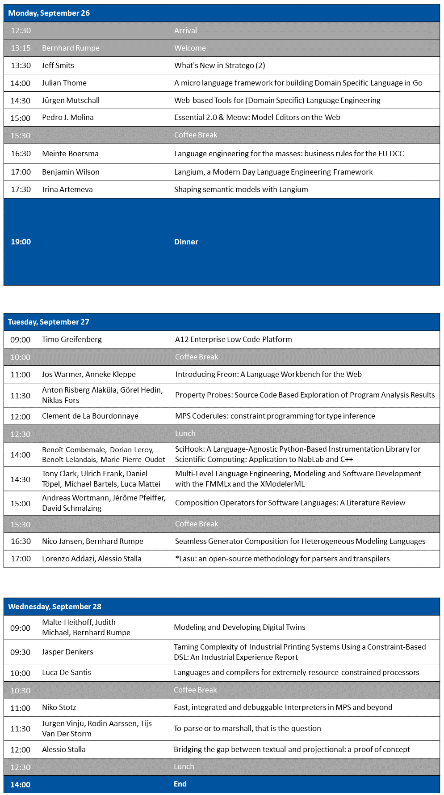
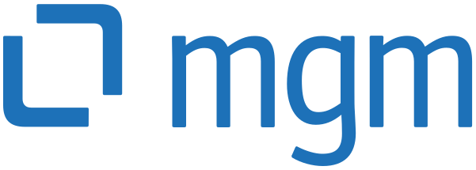
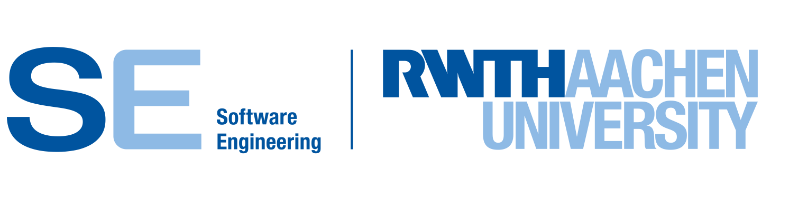

## LangDev Meetup at RWTH Aachen 26-28 September 2022

The Language Developer’s Meetup (LangDev) is an informal meeting where language engineering enthusiasts from both industry and academia can come together to discuss the state-of-the-art and state-of-the-practice of language engineering.  

### Location

RWTH Aachen Informatikzentrum - Ahornstraße 55 - 52074 Aachen, Germany

Click [here](https://goo.gl/maps/rf4NACmxXaweaNeVA) for Google Maps.

### Registration

Tickets are available at eventim-light following **[this link](https://www.eventim-light.com/de/a/62e8bdb03e787c1c90eb8d0a/e/62e8c4e4287fea3cefd49346/)**.

### Important Dates (deadlines extended)
* **01.07.2022**: Call for Presentations 
* ~~15.08.2022~~ **18.08.2022**: Submission Deadline
* **01.09.2022**: Acceptance Notification
* **26.09.2022-28.09.2022**: LangDev'22 Meeting

### Accepted Talks and Abstracts

Clement de La Bourdonnaye: **MPS Coderules: constraint programming for type inference**

Defining rules for type computations in a new language is not an easy task. MPS historically provides DSLs for defining such system, but these are restricted to a range of usages and may not be explicit when it comes to their behavior.

Coderules offers a new framework in MPS for defining type inference system using a constraint handling rules system, which offers to lift those limitations.

This talk will, after briefly introducing the theory behind those constraints, present the features offered by Coderules through a demonstration and then show a concrete application of these principles with the type system of the Kotlin language for MPS.   

Vadim Zaytsev: **Weight and See: Having Fun with Weighted Grammars**

Weighted and probabilistic grammars are grammars where production rules are annotated with some values or expressions that guide their "execution" (in the sense of parsing or generation). They found their uses in computer vision, natural language processing, password cracking, test generation, constraint solving, equation discovery, biosequence processing, statistical source code analysis, etc.

I am developing a new system to support a particular kind of widely applicable weighted grammars, and can demonstrate its capabilities in things like holding a conversation or proving consistency (which in this context means statistical convergence and termination).

Tony Clark, Ulrich Frank, Daniel Töpel, Michael Bartels, Luca Mattei: **Multi-Level Language Engineering, Modeling and Software Development with the FMMLx and the XModelerML**

Traditional language engineering environments make use of general-purpose meta languages to specify DSMLs. However, this is not the way how technical languages evolve. New concepts are usually not defined from scratch, but by means of existing, more general domain-specific concepts. In this way, not only reuse of existing knowledge, but also integrity of new concepts are promoted. The multi-level meta language FMMLxadopts this approach. It allows the specification of DSMLs with
existing DSMLs over an arbitrary number of levels. The FMMLxis implemented with the XModeler. The XModeler is a language engineering workbench whose core language is reflexive and extensible. In this way, the XModeler is both an instance of itself and a basis for defining a wide range of co-existing language variants. The FMMLx represents an extension of the XModeler’s meta model, XCore, to introduce explicit levels and deferred instantiation. The resulting version of the XModeler, called XModelerML, also features a new user interface that supports multiple modes of creating, modifying and interacting with objects at any level. Languages, corresponding models and code share the same representation and can be modified at runtime. The XModelerMLcan be downloaded from the webpages of the project “Language Engineering for Multi-Level Modeling”4 that also provide various screencasts which illustrate the use of the FMMLx.

Mikhail Barash, Simen André Lien: **Example-Driven Software Language Engineering**

Language workbenches---tools to define software languages together with their IDEs---are designed to simplify language engineering and implementation: they free language engineers from many meticulous tasks, but oftentimes have a very steep learning curve even for experienced software professionals. With the assumption that meta-definitions are one of the key factors that hinder language engineering, we introduce an example-driven approach to language definition, where a language is defined by giving examples of code written in it. These examples can then be annotated to specify different concerns of language definition: abstract syntax, typing rules, validation rules, formatting rules, and dynamic semantics.

We will demonstrate a web-based prototype implementation of the proposed approach. A user can specify syntax and associated validation rules for every language construct by annotating sample code snippets, each of which is given in a separate Monaco editor. Updates to syntax specifications are thus directly visible to the user. The tool is aimed at non-experienced language engineers and supports interactive workflow, e.g., "drag-and-drop copying" of (properties of) specifications across language constructs. From a language specification done with our tool, we generate a grammar for text-based language workbench Langium, which in its turn generates a VSCode-based IDE for the language.

Full text of the work can be found at: https://bora.uib.no/bora-xmlui/handle/11250/3001961

Implementation available at: https://git.app.uib.no/Simen.Lien/example-driven-software-language-engineering

Jasper Denkers: **Taming Complexity of Industrial Printing Systems Using a Constraint-Based DSL — An Industrial Experience Report**

Flexible printing systems are highly complex systems that consist of printers, that print individual sheets of paper, and finishing equipment, that processes sheets after printing, e.g., assembling a book. Integrating finishing equipment with printers involves the development of control software that configures the devices, taking hardware constraints into account. This control software is highly complex to realize due to (1) the intertwined nature of printing and finishing, (2) the large variety of printing and finishing options, and (3) the variety of underlying hardware in the product line of finishers.
We have developed a domain-specific language called CSX that offers an interface to constraint solving specific to the printing domain. We use it to model printing devices and to automatically derive constraint solver-based environments for automatic configuration.
In this talk, we will introduce CSX and present our evaluation of CSX on its coverage of the printing domain in an industrial context, and we report on lessons learned on using a constraint-based DSL in an industrial context.

Julian Thome: **A micro language framework for building Domain Specific Language in Go**

Prototyping, designing and evolving a Domain Specific Language (DSL) is a
challenging process. Usually this is an exploratory cycle of prototyping ideas,
incorporating them into the language, trying them out in reality, collecting
feedback and improving the DSL based on the feedback.

DSL frameworks such as Xtext or MPS are great tools to support custom language
design. While these frameworks are very powerful and feature-rich, they also
have a steep learning curve and require additional tooling which makes them a
good fit for designing/building sophisticated DSLs as opposed to small,
focused, embeddable languages which we refer to as micro languages.

At GitLab, for our own use-case we were looking for a micro language framework
that is simple, flexible, composable and which supports the process of going
through the exploratory cycle of DSL design for Go applications. In this talk
we will discuss micro languages, their application as well as micro language
engineering by means of Lingo, the micro language framework for building Domain
Specific Languages we developed at GitLab. Lingo provides a simple, extensible
language core. It can be easily extended with custom-types and custom
functions.

Anton Risberg Alaküla, Görel Hedin, Niklas Fors: **Property Probes - Source Code Based Exploration of Program Analysis Results**

Viewing program analysis results in an editor is useful, both for ordinary developers and for developers of the analyses.
Existing protocols for editor-analyzer communication, like LSP, are however typically limited to specific kinds of analysis results and do not support the exploration of analysis sub-steps.

We present "Property Probes", a mechanism for helping a developer interactively explore partial program analysis results in terms of the source program, and as the program is edited.
The approach is general in that any property of an abstract syntax tree (AST) node can be viewed.
We see property probes as a complement to traditional tools like breakpoint/step-debuggers or "print-debugging", especially during development of program analysis tooling.

We have implemented a client-server based tool with support for property probes.
We will demonstrate this tool and create probes that inspects the functionality of ExtendJ, an extensible Java compiler.
More precisely, we will create probes that show type checking, control-flow graph construction, bytecode generation, pretty printing and more.

We will also present an algorithm for tracking a single AST node across multiple versions of a text document, which is necessary for a good property probe experience.

Irina Artemeva: **Shaping semantic models with Langium**

Every first step towards any programming or domain specific language starts with parsing source code into an abstract syntax tree. This is the foundation on which one starts building further language support, such as interpreters, compilers, or IDE functionality. Consequently, how one determines to shape their semantic model directly impacts how to implement these advanced features. We have seen language engineering frameworks, such as Eclipse Xtext, infer semantic models from grammar declarations. This approach has proven to be very useful for prototyping languages as well as designing mature language systems. As Xtext's spiritual successor, Langium has adopted, simplified, and improved this idea.

This talk focuses on the features and systems that Langium employs to infer and create semantic models. We will discuss how Langium has enhanced Xtext methods, to bring them to a level that modern developers expect. In our demonstration, you will get to see Langium's features and capabilities in action while we build a new DSL.

Malte Heithoff, Judith Michael, Bernhard Rumpe: **Modeling and Developing Digital Twins**

A digital twin accompanies its cyber-phsical counter-part during operation and with that provides useful information to improve its usage and understanding of its emerging behavior. Development and configuration of a digital twin often remains the task of professinal software engineers who lack in domain expertise. In this talk, we present an approach to enable domain experts to model, generate and configure self-adaptive twins for cyber-physical production systems. We propose a low-code development platform which provide a base architecture for our digital twin, pre-defined language components suited for the production domain, and infrastructure to develop a digital twin cockpit. To maximize flexibility, the platform itself is developed in a model-driven manner and can be adjusted to fulfill the needs of domain experts in a specific use-case.

Niko Stotz: **Fast, integrated and debuggable Interpreters in MPS and beyond**

Interpretation enables highly interactive scenarios for many DSLs, such as life execution of test cases, consistency checks, or spreadsheet-like immediate evaluation and feedback. Implementing interpreters is usually boring: Each concept in the DSL needs a typically simple evaluator, and a lot of boilerplate infrastructure. This cries for an interpreter DSL!

After prototyping the first (and by now, widely used) interpreter in MPS ^1, and showing a much faster proof of concept some time ago ^2, we now present a well-engineered, fully integrated new language aspect for interpreters in Jetbrains MPS.
The new language aspect:
- is based on GraalVM's Truffle framework to achieve top performance
- runs on stock MPS
- allows interactive debugging from within the same MPS instance
- enables non-blocking asynchronous execution
- can be re-used outside MPS.
It follows the ideas outlined in ^3.

This talk focuses on demonstrating the interpreter in action. We show aforementioned features, discuss known drawbacks and look at future enhancements. The implementation will be available as Open Source.

^1: http://mbeddr.com/interpreter/Interpreter.html  
^2: https://www.youtube.com/watch?v=jdFZTxElz1U&list=PLQ176FUIyIUZXibX-WXeiBAM8VnuohJZQ&index=15  
^3: https://www.nikostotz.de/blog/high-performance-interpreters-for-jetbrains-mps/  

Jürgen Mutschall: **Web-based Tools for (Domain Specific) Language Engineering**

The roots of the established tools and modeling approaches (e.g. UML/SysML, MetaEdit+, EMF, Sirius, Xtext, MPS) lie in the research ideas of the 90s or 2000s. Even though these have been proven in practice and have gained a lot of functionality over many iterations, they do not really take advantage of today's technical possibilities.
In 2019 Markus Voelter’s call for an “Open Platform for Systems and Business Engineering Tools” outlines a requirement profile for a future development environment for system and (domain) language engineers. The community is currently in search for easy-to-use web based, scalable development tools with textual and graphical notations and good multi-user support, which address this vision of a future platform.
This presentation gives an overview of the state of development of a new language engineering workbench, based on an extendable central repository, a modern web-native microservice platform and IDE-like, web-based editing frontends, which targets a state-of-the-art user experience for the (domain) language engineers or subject matter experts /users.
Following the presentation a live demo will show some of the key elements, like web-oriented "Blended Modeling" and the capabilities of the web browser for advanced projectional editing.

Pedro J. Molina: **Essential 2.0 & Meow: Model Editors on the Web**

Essential is a Language Workbench and tooling for implementing Model Driven tools on .NET initiated in 2008.

During this time the tool has been adapted to create metamodels, models, templates and model transformation in a complete integrated development environment (IDE). Essential has been used with success to prototype, create and evolve high-quality commercial code-generators.

In the last years, works to migrate Essential to the Web (version 2.0) has been performed to allow using its potential for cloud-based application and in the browser. Quid is one of the first tools created using Essential for Web.
Moreover, Essential 2.0 is totally web-based and parsers and model editors has been recreated from scratch into TypeScript to fully embrace the Web platform and provide easy tooling for creating modeling environments on the Web.
In this sense, Meow is a companion library for Essential to allow dynamically edit models on the web enforcing an arbitrary Essential Metamodel.
Bindings for importing and exporting EMF ECore Models are provided to make it easy to reuse models.

Demo outline:
- The demo will show Essential desktop version to introduce the DSLs used for metamodels, model, templates and model transformations.
- Then second part of the demo consist in using the web version to create a metamodel at: http://essential.metadev.pro
- Finally, a concrete document will be edited using MEOW components to enforce a concrete model. Example: Navigation Design Specification for the European Space Agency (developed in collaboration with the University of Alcal de Henares, Spain).
http://est40.metadev.pro

Andreas Wortmann, Jérôme Pfeiffer, David Schmalzing: **Composition Operators for Software Languages: A Literature Review**

Efficiently engineering software languages demands their reuse through composition. Research in software language engineering has produced many different operators to reuse and compose languages and language parts. These operate on different dimensions of languages, produce diverse results, and are distributed across various technological spaces and publications. This hampers understanding the state of language composition for researchers and practitioners. To address this, ten years ago, Erdweg et al. identified five categories of software language composition. Since then, innovations in software language engineering question whether this classification still holds. To this end, we report the results of a literature review on language composition operators that have since been published. In this review, we identify operators, their properties, supported language dimensions, and relate them to the categories of language composition. Through this, our survey draws a new, detailed map of language composition operators that can guide SLE researchers in identifying uncharted territory and practitioners in employing the most suitable composition operators.

Alessio Stalla: **Lasu: an open-source methodology for parsers and transpilers**

We present the result of our extensive experience, research and development in the field of Parsers, Transpilers, and Editors.
Our established methodology, dubbed “*Lasu” (StarLasu), provides for a standardized pipeline that begins with a parser producing a parse tree. In the second stage, we transform the parse tree into an abstract syntax tree (AST). Then we apply AST transformations until we arrive at the final result (for example, code generation).

To support our methodology, we’ve published a set of open-source libraries for the following platforms: the JVM, Python, and JavaScript (browsers and Node.js).
These libraries provide:
- Building blocks to construct an AST.
- Traversal and transformation operators.
- Tracking of the origin and destination of each AST node, from the source text to generated text.
- Collecting all kinds of parsing issues under a uniform interface.
- Import/export of the AST in several formats (including ECore).
- Convenient packaging of the above into command-line tools.

In a demo, we’ll show our approach in action, by constructing an AST iteratively from a simple ANTLR parser, and showcasing tree traversal and transformation. We’ll use the Kotlin language.

Benoît Combemale, Dorian Leroy, Benoît Lelandais, Marie-Pierre Oudot: **SciHook: A Language-Agnostic Python-Based Instrumentation Library for Scientific Computing — Application to NabLab and C++**

Implementation and use of scientific software (such as physics simulators) necessitates reconciling experimental measurements, continuous and discrete mathematics, and software- and system-level concerns. This places high demands on practitioners, who must use myriads of tools rarely available in a single IDE and requiring diverse skills (e.g., design of complex simulation processes, monitoring of physics properties, management of I/O operations, debug of numerical schemes).

To alleviate this, we introduce SciHook, a small set of concepts to be combined to cover various verification and validation (V&V) and usage scenarios for scientific computing.

In this talk, we will present how we came to design SciHook, a Python-based library relying on source code instrumentation, which can be bound to any, possibly domain-specific, language. In particular, we leveraged on SciHook to instrument both programs conforming to NabLab, a compiled DSL for numerical analysis targeting C++, and pre-existing C++ scientific software. The binding of SciHook to a particular language requires to expose an instrumentation interface for the targeted language, that SciHook helps define through dedicated facilities.

We will then show how we integrated SciHook into the code generation infrastructure of the DSL NabLab. This in turn allows to automatically generate an instrumentation interface of NabLab models, exposing their execution context to Python tools registered to its instrumentation points. We also demonstrate how to bind SciHook directly to C++ for instrumenting scientific software directly written in C++.

Nico Jansen, Bernhard Rumpe: **Seamless Generator Composition for Heterogeneous Modeling Languages**

In Software Language Engineering, code generators transform models of different languages into artifacts of executable program code. While the reuse of existing language components and composition of their models is becoming more prominent, there still is a research gap in composing their associated generators. Generated artifacts, especially from models of multiple, heterogeneous languages, must be adapted to each other, requiring a certain degree of coordination between the generators. Existing solutions only cover specific application areas or, in contrast, provide a too generic interface, increasing complexity beyond the actual benefit. In this talk, we present a solution for template-based generator composition utilizing the symbol table of languages to distribute generator-specific information. The concept is based on storing and loading symbol tables and distributing access information of heterogeneous model elements at the code level. Ultimately, we present a lightweight interface for generator composition between aggregated languages. The talk will be accompanied by a tutorial in which practitioners compose generators of different languages, apply hands-on modifications to them, and then experience the automated adaptation of the generated artifacts.

Meinte Boersma: **Language engineering for the masses: business rules for the EU DCC**

On July 1st 2021, the European Union Digital COVID(-19) Certificate (the EU DCC) went into production. Holders of an EU DCC QR-code use it to prove that they have been tested negative for, recovered from, or been vaccinated against COVID-19. Every country participating in the EU DCC has the possibility to declare business rules to determine automatically whether someone is deemed fit to enter that country based on a DCC presented.

In this talk, I will explain the EU DCC and its business rules framework, and in particular, the language engineering used in defining machine-processable, exchangable business rules. Also, I'll give some insights on the challenges associated with the EU DCC effort, and how these shaped design and implementation.

Jos Warmer, Anneke Kleppe: **Introducing Freon: A Language Workbench for the Web**

A couple of years ago the development of ProjectIt, an open-source projectional editor for the web, was started. Earlier versions of this workshop have included reports on this tool. Currently, this project has grown into more than an editor. It may now be regarded to be a language workbench, which calls for a name change. The workbench is now called Freon.
This presentation takes you through the components that constitute the Freon Language WorkBench: the scoper, the typer, the validator, the parser, the interpreter, and, of course, the editor. An explanation is given on how a language engineer may use the components to develop a webbased tool that supports the engineer’s clients DSL. Also, the reason is given why a tool that uses projectional editing should include a parser.
Special attention will be given to the stacked architecture. The first and second layers in this architecture enable the language engineer to quickly prototype a DSL using a set of language description languages, i.e. meta languages. The third layer fully supports the fine-tuning of the DSL tool to the client’s needs. The presentation will conclude with a small demonstration.

Luca De Santis: **Languages and compilers for extremely resource-constrained processors**

In some industrial applications, the complexity of control system is enough high to require a processor, but commercial solutions don’t fit area, power and speed constraints. In these special cases, an “in-house” processor development is necessary, but to make the solution effectively usable, a custom language and an associated compiler are necessary. In this talk we are going to show some specific features of custom compilers design for a highly resource-constrained processor, like:
1. Hardware specific variables typing, to address specialized storage media, as opposed to generic virtualized typing in general-purpose languages.
2. Architecture-aware programming as opposed to generic heap/stack programming models.
3. Instruction substitution required to change hard-wired code and the problem of registers mapping.
4. The concept of “Instruction-set and compiler in the optimization loop” to effectively address the problem of constraints fitting.

Jeff Smits: **What's New in Stratego (2)**

In this talk I will briefly introduce the Stratego term rewriting language for people who don't know it (well), in the form of a demo. During the demo I will highlight some of the features that Stratego has gained over the last few years: an incremental compiler, a gradual type system, and some pattern matching optimisation. This has culminated in the alpha release of Stratego 2. Given that there is only 25 minutes, I will only highlight the first two in the demo. Then I'll take a vote from the audience on what to explain in more detail, which may involve some slides or whiteboard scribbles.
Demo outline: (1) Introduction to the environment of the Spoofax language workbench, and the Tiny Imperative Language on which we will apply transformations written in Stratego. (2) A basic Stratego module, import of signatures of TIL, writing a rewrite rule, applying it with a rewrite strategy, seeing its result. (3) Noting the incremental compilation, with a relatively short feedback cycle, looking at the build log to see that only changed files are recompiled. (4) Adding a type signature to our rewrite rule, looking at the interaction with rewrite strategies.

Jurgen Vinju, Rodin Aarssen, Tijs Van Der Storm: **To parse or to marshall, that is the question**

In reverse language engineering, with its applications to software quality assessment, static analysis, software maintenance and evolution, refactoring, and renovation, the first question is always how to obtain a high-quality parser for the given language(s).

During the last two decades, a storm of open-source, open-access, open compiler frameworks for programming languages have shifted the balance from "better generate parser" to "better map an existing parser" completely. Nevertheless important quality considerations (like high-fidelity, low-noise, and efficiency) are still under scrutiny.

In this talk we revisit a number of mapped parsers and rewritten grammars for (legacy) programming languages in the Rascal eco-system: Java, C/C++, PHP, Ada; and we discuss implementation effort and design decisions, next to common problems. Recently, it was made possible for Rascal programmers to use also "concrete syntax matching" on syntax trees that were acquired from external sources. This final blow completely unbalances the trade-off towards parser reuse and lets grammers in the corner of the domain-specific languages. Or doesn't it?

Alessio Stalla: **Bridging the gap between textual and projectional: a proof of concept**

Textual and projectional editors each have their advantages and disadvantages. Both users and developers know very well how to work with text. However, textual syntax limits our expressiveness, readability, and interactivity, among other things. On the other hand, projectional editors are still complicated to develop and use, even if we’ve made great progress, and text editing in projectional editors is not on par with our best text editors.

So, we present an innovative approach to editors, based on ProseMirror, a JavaScript toolkit for building web-based word processor applications. ProseMirror is well-suited for editing text out of the box, and it features an extensible schema of arbitrarily nested blocks with attributes. Built-in blocks include paragraphs, lists, and tables.
We’ll show an early prototype of an editor that is the result of a research and development effort by Strumenta, aimed at combining strong rich-text editing capabilities with a projectional approach. We’ll demonstrate how ProseMirror blocks can be hooked to a parser to provide some language intelligence, and how we can progressively migrate to a projectional approach where no parser is involved.

Benjamin Wilson: **Langium, a Modern Day Language Engineering Framework**

When designing languages it is important to produce a quality language that runs on the right platforms. However, even the best languages can be limited by the systems they were designed for. Language engineers must often consider these constraints as a trade-off. To this end, we propose a way to both design high-quality languages and avoid compromising on system flexibility. We present Langium, an LSP-based language engineering framework based on Typescript and driven by the Chevrotain parser library.

Langium facilitates designing languages, complete with built-in support for linking and scoping. Services are provided out of the box, allowing rapid prototyping with the ability for full customization. Validation and generation can also be implemented easily using Langium’s APIs. By leveraging Typescript, Langium is capable of running on a wide variety of platforms, such as in the web — without a backend. Additionally, with the LSP, Langium easily integrates with popular editors such as VS Code and Monaco. In this talk we demonstrate how to leverage these aforementioned features to design a language, customize it, and even deploy it on the web.

### Preliminary Schedule

### Call for Presentations

We solicit talk proposals concerning the application, development, and innovation of language engineering. Topics of interest include, but are not limited to:
* Novel meta languages for language construction and composition
* Holistic approaches to language engineering that cross-cut multiple language aspects (e.g., abstract and concrete syntax, semantics, transformations) and/or integrate with program analysis, validation, testing, or other advanced techniques. 
* New language workbenches or novel extensions of existing language workbenches.
* Backend infrastructure of (web-based) language workbenches explaining solutions to collaboration, synchronization, or communication. 
* Industrial case studies: experience reports, large-scale evaluations, best practices, and human factors to adoption. 
* Low-Code / No-Code approaches using appropriate languages
  * Languages for describing and deriving digital twins
  * Languages for non-engineering issues, such as science, legal, social, or environmental sustainability issues
  * DSLs engineered on the basis of GPLs and GPMLs (general-purpose languages)

LangDev seeks presentations that demonstrate applied aspects of language engineering. Presentations explaining the theory behind language engineering are also welcome, but they need to showcase the practical applicability of the presented approaches. Presentations about preliminary or unfinished work are welcome.  

We encourage presenters to demonstrate their work with a **demo or live coding** over “just” showing slides. Additionally, we encourage speakers to accompany their presentations with a **reproduction package** that helps the participants to (easily) run the presented tools, experiment with them, or tweak benchmark experiments. This helps to create a lasting contribution. 

**Talk proposals should be submitted by August 15 via [easychair](https://easychair.org/conferences/?conf=langdev22).** A proposal includes a title and a short (maximum 200 words) abstract. As LangDev is an international meeting, the proposals and talks should be in English. In case the talk is accompanied by a demo, we encourage presenters to also provide a brief demo outline as part of the proposal. Presenters will have 30 minutes for their talks (25 min talk + 5 min Q&A). Presenters may choose to follow a traditional presentation style where the Q&A is at the end of the talk, or they may follow a chess timer-based style. Notifications about acceptance will be sent out by September 01. 

### Organization & Program Committee

Organizers:
* Bernhard Rumpe, Software Engineering - RWTH Aachen
* Nico Jansen, Software Engineering - RWTH Aachen  

Program Committee:
* Benoit Combemale, Software Engineering - Université de Rennes
* Sebastian Erdweg, Programming Languages - Johannes Gutenberg University Mainz
* Bernhard Rumpe, Software Engineering - RWTH Aachen
* Federico Tomassetti, Strumenta
* Vadim Zaytsev, Software Evolution - University of Twente

All proposals will undergo light reviewing by the program committee.  

In case you have any further questions, please contact: jansen@se-rwth.de 

---

LangDev'22 is organized by [mgm technology partners GmbH](https://a12.mgm-tp.com/) and the [Chair of Software Engineering, RWTH Aachen](https://www.se-rwth.de/)

  &emsp; &emsp; &emsp;  

